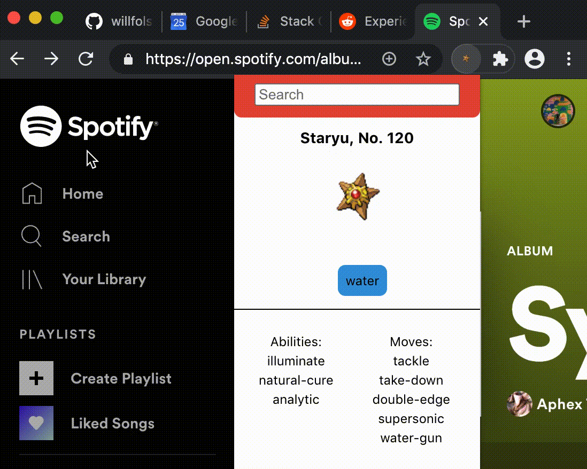

# Pokechrome 

### Pokedex Chrome Extension

This is a Chrome Extension and React App using Typescript, Webpack, SASS, and the PokeAPI. It can be built and installed in your browser. 

(Working as of 3/21/21. If something is up, open an issue.) 

---

### Encounter Pokemon in Tall Grass (aka The Internet)

As you switch tabs, the Pokedex will identify a Pokemon (from the original generation) associated with the tab you are viewing, as it would during a random Pokemon encounter in tall grass. It will then update the extension icon, and can display the Pokedex information, as well as a search bar for other Pokemon. 

(Note the extension icon changing and the loader.)

---

### Run It

#### `npm i`

#### `npm run build`

Builds the app as a usable Chrome Extension to the **build** folder. 
Navigate to **chrome://extensions** in Chrome, then click **Load unpacked** and select the base **build** folder. 
After loading the extension, it can be debugged in the same way as a web app. 

#### `npm run clean-install`

Nukes node_modules/ and build/ and re-installs.

---

### Background.js Disclosure

This uses a background script to listen to the active Chrome tab.
