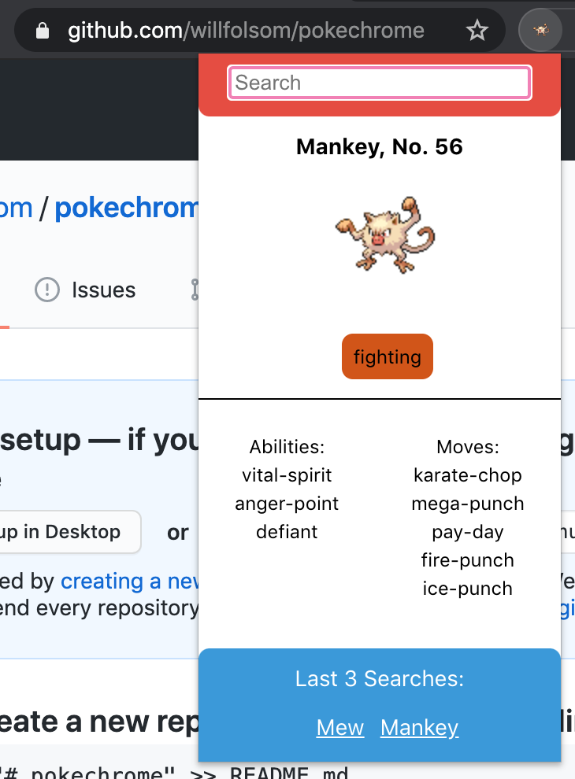
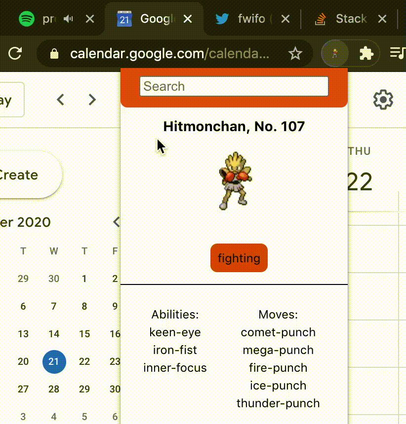

# Pokechrome 

### Pokedex Chrome Extension

This is Chrome Extension and React App using Typescript, Webpack, SASS, and the PokeAPI. It can be built and installed in your browser. 

---

### Encounter Pokemon in Tall Grass (aka The Internet)

As you navigate to different tabs, the Pokedex will identify a Pokemon from the original generation associated with the current tab you are viewing, as it would during a random Pokemon encounter in tall grass. It will then update the extension icon, and can display the Pokedex information, as well as a search bar for other Pokemon. 

(These gifs slowed down the process, but the process is faster and responsive.)

---

### Run It

#### `npm i`

#### `npm run build`

Builds the app as a usable Chrome Extension to the **build** folder. 
Navigate to **chrome://extensions** in Chrome, then click **Load unpacked** and select the base **build** folder. 
After loading the extension, it can be debugged in the same way as a web app. 

---

### Background.js Disclosure

This does use a background script to listen to the active Chrome tab.
